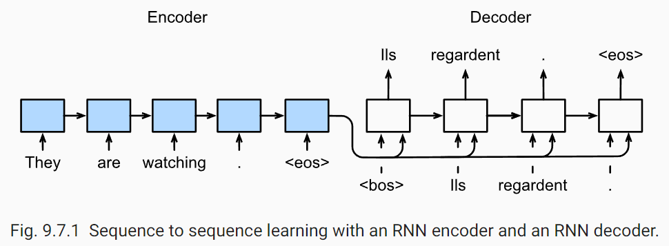
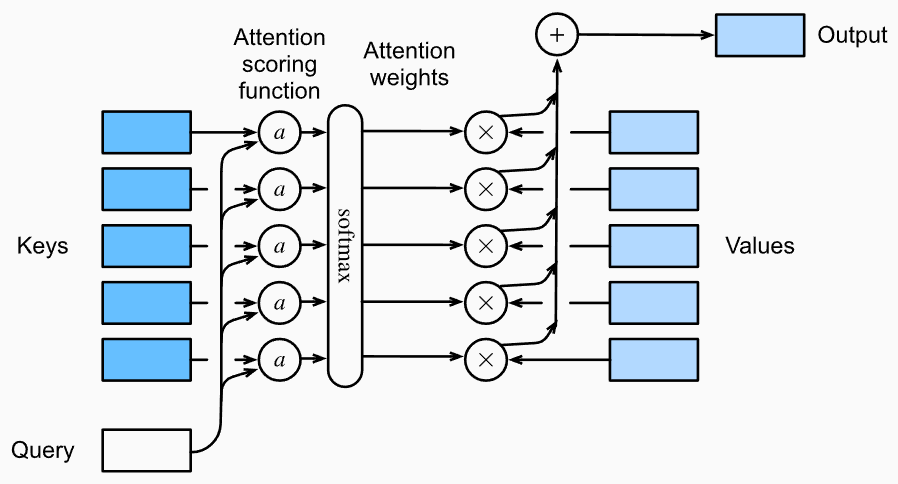
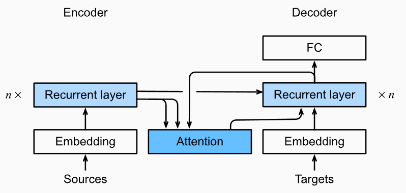

## Seq2Seq:

At any time step $t'$ at decoder stage, the RNN takes the output $y'_{t-1}$ from the previous time step and the context variable $c$ (Encoder's output) as input.

## Attention Mechanisms:

Suppose that we have a query $\mathbf{q} \in \mathbb{R}^q$ and $m$ key-value pairs $(\mathbf{k}_1, \mathbf{v}_1), \ldots, (\mathbf{k}_m, \mathbf{v}_m)$, where any $\mathbf{k}_i \in \mathbb{R}^k$ and any $\mathbf{v}_i \in \mathbb{R}^v$. The attention pooling is instantiated as a weighted sum of the *values*:
$$
f(\mathbf{q}, (\mathbf{k}_1, \mathbf{v}_1), \ldots, (\mathbf{k}_m, \mathbf{v}_m)) = \sum_{i=1}^m \alpha(\mathbf{q}, \mathbf{k}_i) \mathbf{v}_i \in \mathbb{R}^v,
$$
where the attention weight(scalar) $\alpha(\mathbf{q}, \mathbf{k}_i)$ for $\mathbf{v}_i$ is computed over $\mathbf{q}, \mathbf{k}_i$ by the softmax operation of an attention scoring function $a$ that maps **two vectors** to a **scalar**:
$$
\alpha(\mathbf{q}, \mathbf{k}_i) = \mathrm{softmax}(a(\mathbf{q}, \mathbf{k}_i)) = \frac{\exp(a(\mathbf{q}, \mathbf{k}_i))}{\sum_{j=1}^m \exp(a(\mathbf{q}, \mathbf{k}_j))} \in \mathbb{R}.
$$

For implementation: 

input: Q: [bsz, num_queries, query_size], K: [bsz, num_kv, key_size], V: [bsz, num_kv, value_size]

output: atten_weights: [bsz, num_q, num_kv]
V: [bsz, num_q, v_size]

## Seq2Seq+Attention:

Suppose there are T tokens in the input sequence, the context variable at the decoding time step $t'$ is the output of the attention pooling:
$$
\mathbf{c}_{t'} = \sum_{t=1}^T \alpha(\mathbf{s}_{t' - 1}, \mathbf{h}_t) \mathbf{h}_t,
$$
where the decoder hidden state $\mathbf{s}_{t' - 1}$ at time step $t'-1$ is the query, and the encoder hidden states $h_t$ are both the keys and values, and the attention weight $\alpha$ is computed by some attention function.

