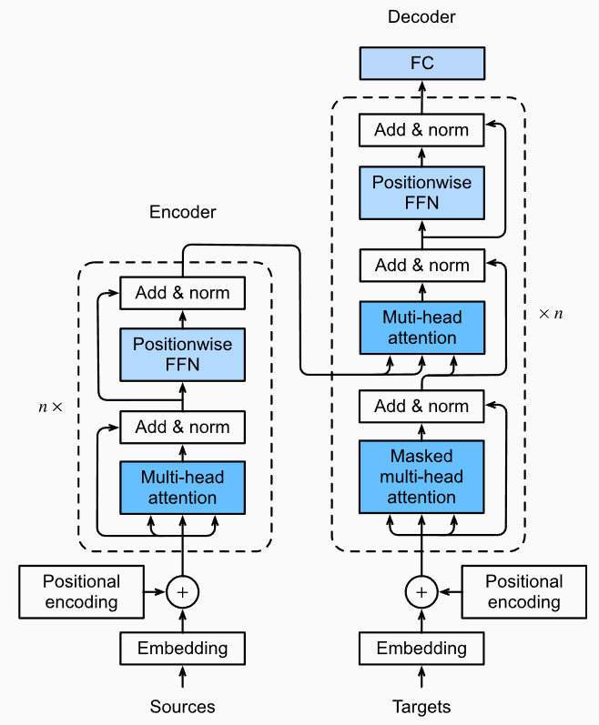

## Attention Mechanisms

Query和Keys经过Attention scoring function算出注意力分数，归一化之后得到Attention Weights。注意力权重和Values相乘得到输出。

Suppose that we have a query $\mathbf{q} \in \mathbb{R}^q$ and $m$ key-value pairs $(\mathbf{k}_1, \mathbf{v}_1), \ldots, (\mathbf{k}_m, \mathbf{v}_m)$, where any $\mathbf{k}_i \in \mathbb{R}^k$ and any $\mathbf{v}_i \in \mathbb{R}^v$. The attention pooling is instantiated as a weighted sum of the *values*:
$$
f(\mathbf{q}, (\mathbf{k}_1, \mathbf{v}_1), \ldots, (\mathbf{k}_m, \mathbf{v}_m)) = \sum_{i=1}^m \alpha(\mathbf{q}, \mathbf{k}_i) \mathbf{v}_i \in \mathbb{R}^v,
$$
where the attention weight(scalar) $\alpha(\mathbf{q}, \mathbf{k}_i)$ for $\mathbf{v}_i$ is computed over $\mathbf{q}, \mathbf{k}_i$ by the softmax operation of an attention scoring function $a$ that maps **two vectors** to a **scalar**:
$$
\alpha(\mathbf{q}, \mathbf{k}_i) = \mathrm{softmax}(a(\mathbf{q}, \mathbf{k}_i)) = \frac{\exp(a(\mathbf{q}, \mathbf{k}_i))}{\sum_{j=1}^m \exp(a(\mathbf{q}, \mathbf{k}_j))} \in \mathbb{R}.
$$

## Scaled Dot-Product Attention

This kind of attention requires both the *query* and the *key* have the same vector length $d$. The scaled dot-product attention scoring function is:
$$
a(\mathbf{q}, \mathbf{k}) = \mathbf{q}^\top \mathbf{k} / \sqrt{d}
$$
In practice, for general situations, we need to compute attention for $n$ queries and $m$ key-value pairs, where queries and keys are of length $d$ and values are of length $v$. The scaled dot-product attention of queries $\mathbf Q\in\mathbb R^{n\times d}$, keys $\mathbf K \in \mathbb R ^ {m \times d}$, and values $\mathbf V\in\mathbb R^{m\times v}$ is:
$$
\mathrm{softmax}\left(\frac{\mathbf Q \mathbf K^\top }{\sqrt{d}}\right) \mathbf V \in \mathbb{R}^{n\times v}.
$$

## Self-Attention

From a high-level, self-attention outputs representations for each $x_i$ in the input sequence.

In self-attention, query, key, value are the same.

Given a sequence of input tokens $\mathbf{x}_1, \ldots, \mathbf{x}_n$ where any $\mathbf{x}_i \in \mathbb{R}^d (1\le i \le n)$, its self-attention outputs a sequence of the same length $\mathbf{y}_1, \ldots, \mathbf{y}_n$, where
$$
\mathbf{y}_i = f(\mathbf{x}_i, (\mathbf{x}_1, \mathbf{x}_1), \ldots, (\mathbf{x}_n, \mathbf{x}_n)) \in \mathbb{R}^d
$$
RNN is good for sequence data, need restrict order; self-attention并行度非常好

CNN vs RNN vs self-attention：

## Transformer

### Multi-head Attention

Given the same set of queries, keys, values, we may want our model to combine knowledge from different aspects of the same attention mechanism. Thus, it may be beneficial to allow our attention mechanism to jointly use different representation subspace of queries, keys and values.

Different Heads have different linear transformation, i.e. different weight matrix.

### Transformer

输入和输出之间维度相同，相当于对每个输入求得了一个表示

LayerNorm和BatchNorm不同，LayerNorm是对每个样本进行norm

Encoder和Decoder之间传递的是正常的Attention，和Seq2Seq+Atten非常像

